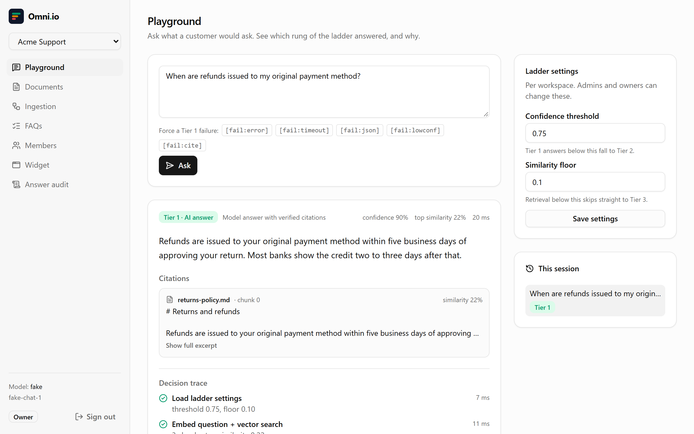
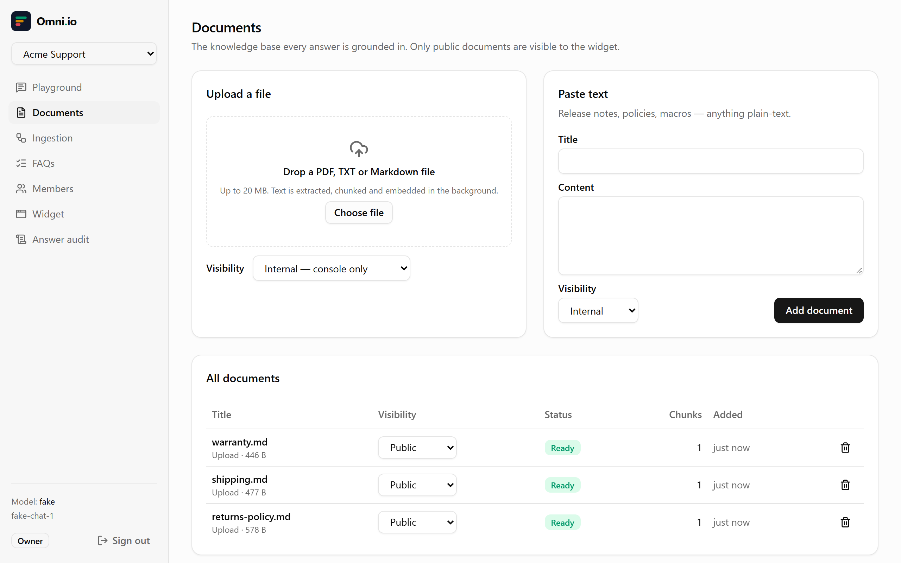
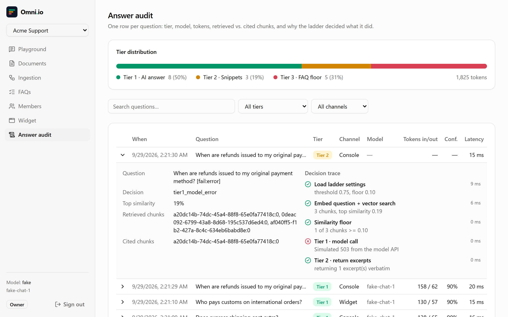
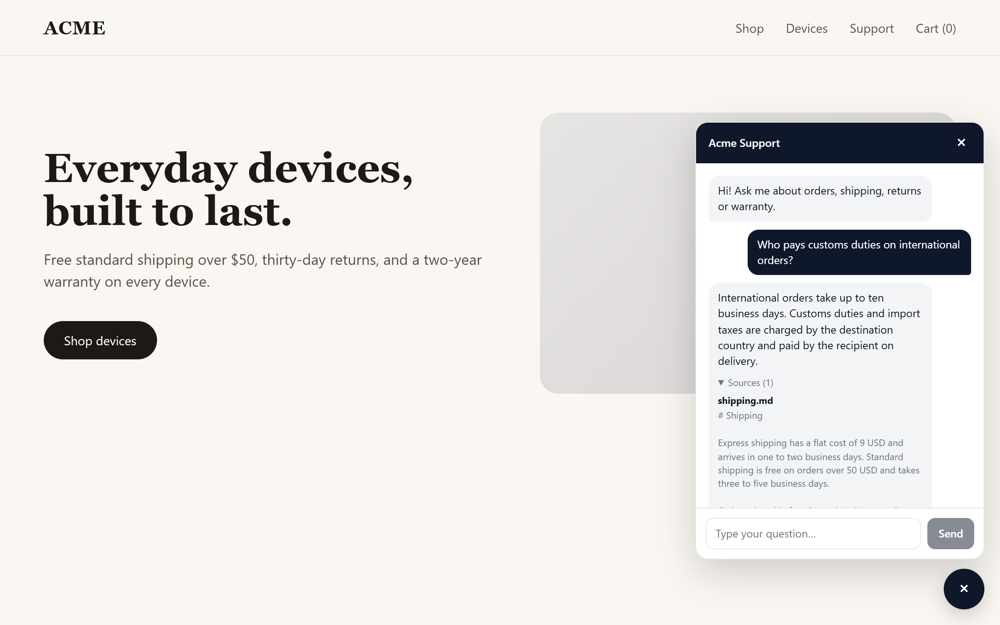
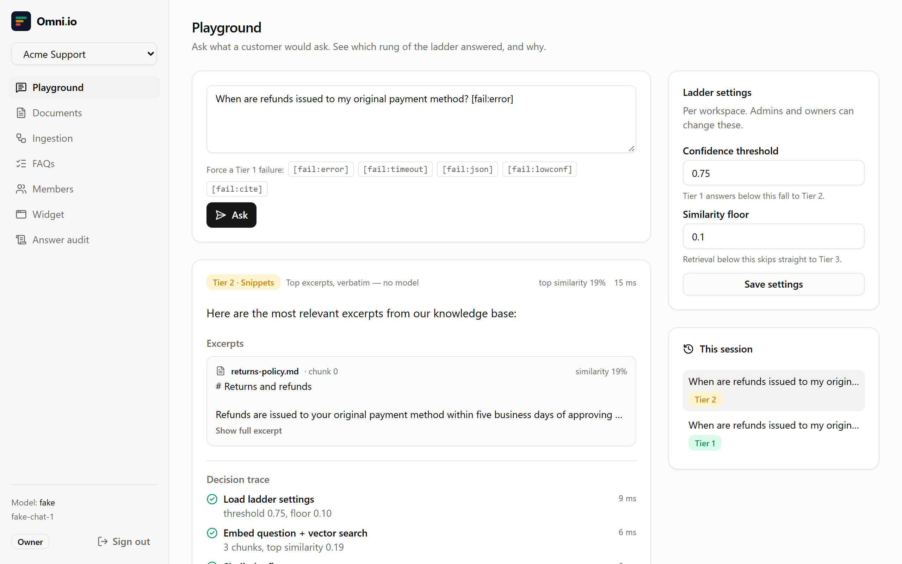
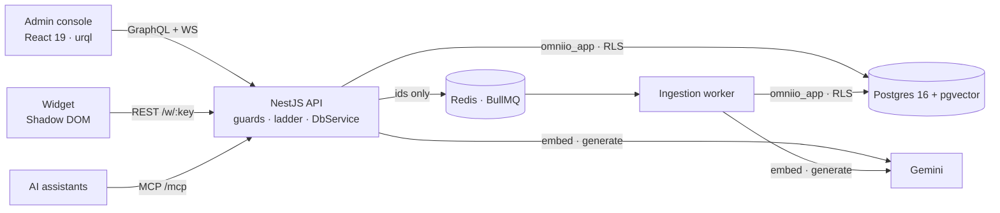

<p align="center">
  <picture>
    <source media="(prefers-color-scheme: dark)" srcset="docs/assets/wordmark-dark.svg">
    
  </picture>
</p>

<h3 align="center">AI customer support that degrades gracefully instead of failing.</h3>

<p align="center">
  Multi-tenant RAG with a three-tier resilience ladder, tenant isolation enforced by Postgres,<br>
  and a decision trace behind every answer.
</p>

<p align="center">
  <a href="https://github.com/JawadulHadi/omni-io/actions/workflows/ci.yml"></a>
  <a href="https://github.com/JawadulHadi/omni-io/releases"></a>
  <a href="LICENSE"></a>
  
  
  
  
  
</p>

<p align="center">
  
</p>

---

## Why Omni.io

Most RAG demos have one mode: working. When the embedding API is down, the model times out, or it cites a passage it never saw, the customer gets an error or a confident fabrication.

Omni.io is built the other way round:

- **Every question gets an answer.** A cited AI answer if it can be trusted; otherwise the most relevant excerpts verbatim; otherwise a deterministic FAQ or a human hand-off. The ladder is one method, and it never throws.
- **Every answer explains itself.** Each rung the ladder tried, why it moved on, what it cost and how long it took is stored in the audit log and shown to support staff.
- **Tenants can't see each other's data, even through a bug.** Isolation is enforced by Postgres row-level security under a role that can't bypass it, and proven by tests against a real database.

## Features

| | |
| --- | --- |
| **Resilience ladder** | Schema-validated model output, citation ⊆ retrieved checks, per-workspace confidence and similarity thresholds, a hard timeout and a circuit breaker. [How it works →](docs/resilience-ladder.md) |
| **Tenant isolation** | A non-owner `NOBYPASSRLS` app role, one short transaction per unit of work, `nullif`-safe policies, and a few narrow `SECURITY DEFINER` functions. [Deep dive →](docs/multi-tenancy.md) |
| **Ingestion** | PDF, TXT and Markdown up to 20 MB. PDFs are parsed in an isolated thread with a time limit and a memory cap. A separate worker does the rest: word-aligned chunks, batched embeddings, idempotent upserts, retries with backoff, live progress. |
| **Admin console** | Playground with decision trace, documents, ingestion queue, FAQs, members and roles, widget settings, and an answer audit with tier distribution. Light and dark themes. |
| **Embeddable widget** | One `<script>` tag. It renders in a Shadow DOM and answers only from documents and FAQs marked public. Rate-limited per IP and per workspace, with a rotatable key. If Postgres is down, visitors still get the hand-off message. |
| **Auth** | 15-minute access tokens, rotating refresh tokens with theft detection, and live role checks. Single-use invite links, with optional invite-only sign-up. Google sign-in (PKCE) that never links to an existing password account by email. |
| **MCP server** | `list_workspaces`, `list_documents`, `list_faqs`, `ask_question` over Streamable HTTP, scoped to the caller's own permissions. Clients authenticate with revocable personal access tokens. |
| **Cost ceilings** | A daily model-call budget per workspace (Tier 2 after it, not errors), plus limits on questions per user, uploads per workspace and workspaces per user. |
| **Privacy** | GDPR erasure deletes a document's vectors, any stored original and its audit references. Ingestion jobs carry ids only. Customer questions are deleted after `ANSWER_RETENTION_DAYS` (default 90). |

## The resilience ladder

| What goes wrong | The customer gets |
| --- | --- |
| Nothing | **Tier 1**: a model answer citing verified passages |
| The model errors, times out, returns invalid JSON, cites a passage it wasn't given, writes an answer its citations don't support, or isn't confident enough; or the workspace's daily budget is spent | **Tier 2**: the top ≤3 relevant excerpts, verbatim |
| Nothing relevant is found, or the embedding API or vector search is down or hangs | **Tier 3**: a keyword-matched FAQ, or a human hand-off message |
| The audit write fails | The same answer; the failure is only logged |

The reason for every outcome is recorded (`tier1_timeout`, `tier1_invalid_citation`, `retrieval_failed`, …). With the offline fake provider you can force each failure from the playground: `[fail:error]`, `[fail:timeout]`, `[fail:json]`, `[fail:lowconf]`, `[fail:cite]`.

## Screenshots

| | |
| --- | --- |
|  |  |
| **Documents:** upload, visibility, live ingestion | **Answer audit:** tier mix, tokens, why each answer landed where it did |
|  |  |
| **Widget:** one script tag, Shadow DOM, public docs only | **Graceful degradation:** a model outage becomes a Tier 2 answer, not an error |

## Architecture



| Layer | Stack |
| --- | --- |
| API | NestJS 12, GraphQL (Apollo 5, code-first), REST, MCP SDK, zod, class-validator |
| Data | PostgreSQL 16, pgvector 0.8 (HNSW with iterative scan), row-level security, plain SQL migrations |
| Jobs | BullMQ 6 on Redis 7, in a separate worker process |
| AI | Google Gemini (`gemini-3.5-flash`, `gemini-embedding-2` at 768 dimensions) behind a provider interface, plus a deterministic fake |
| Console | React 19, Vite 8, React Router 7, Tailwind CSS v4, shadcn/ui, urql, graphql-ws |
| Widget | A standalone React IIFE bundle in a Shadow DOM, ~72 kB gzipped |

The full design and its trade-offs: **[docs/ARCHITECTURE.md](docs/ARCHITECTURE.md)**, and the [architecture decision records](docs/adr/).

## Quick start

Requires Node 24 LTS and Docker. The app itself runs on Node 22.12+; the unit tests need 24.9+.

```sh
git clone https://github.com/JawadulHadi/omni-io.git && cd omni-io

cd backend
cp .env.example .env               # works as-is: AI_PROVIDER=fake needs no key
docker compose up -d --wait        # Postgres + pgvector, Redis, the omniio_app role
npm ci
npm run migrate                    # applies migrations/*.sql as the schema owner
npm run seed                       # demo@omniio.dev / demo-password-123
npm run start:dev                  # API    → http://localhost:3000/graphql
npm run worker:dev                 # worker (in a second terminal)

cd ../frontend
npm ci && npm run dev              # console → http://localhost:5173
```

Upload the files in [`samples/`](samples/) and try the questions listed there.

For real answers, set `AI_PROVIDER=gemini` and `GEMINI_API_KEY` in `backend/.env`, and set the similarity floor back to 0.6 under Playground → Ladder settings. The seed lowers it to 0.1 for the fake provider's bag-of-words vectors.

## Deploy

One server with Docker Compose: Postgres + pgvector, Redis, the API, the worker, and Caddy with automatic HTTPS.

```sh
cd deploy
cp .env.example .env               # DOMAIN, two DB passwords, JWT_SECRET, GEMINI_API_KEY
docker compose up -d --build       # migrations run first; then https://<DOMAIN>
```

Container platforms and managed databases, the configuration checklist and operations: **[docs/deployment.md](docs/deployment.md)**.

## Testing

```sh
cd backend
npm test            # 70 unit tests: every ladder branch, breakers, grounding, chunking, auth guard, prompt hygiene
npm run test:e2e    # 16 tests against the real Postgres, as omniio_app: RLS, invite links, vector-search fallback, retention
cd ../frontend
npm run build       # typecheck + console + standalone widget.js
```

CI runs all of this on every push, against `pgvector/pgvector:pg16`, and builds both production images.

## Documentation

| Document | What's inside |
| --- | --- |
| [Architecture](docs/ARCHITECTURE.md) | System design, modules, data model, security model, roadmap |
| [Resilience ladder](docs/resilience-ladder.md) | Tiers, gates, decision notes, trace format, failure injection |
| [Multi-tenancy](docs/multi-tenancy.md) | How RLS is made real, roles, definer functions, the new-table checklist |
| [API reference](docs/api.md) | REST, GraphQL operations and roles, MCP tools, rate limits |
| [Deployment](docs/deployment.md) | One-command Docker Compose deploy, topology, database roles, configuration checklist, operations |
| [ADRs](docs/adr/) | Eight architecture decision records |
| [Scaffold review](docs/reviews/2026-09-29-scaffold-review.md) | The 47 findings that took v0.1.0 to v1.0.0 |
| [Changelog](CHANGELOG.md) | Every release, following Keep a Changelog |

## Roadmap

Tier-mix metrics and alerting · a shared circuit breaker · an evaluation set for threshold tuning · MCP OAuth 2.1 · email verification · an S3 storage driver. See [Unreleased](CHANGELOG.md#unreleased).

## Contributing, security, license

Contributions are welcome — start with [CONTRIBUTING.md](CONTRIBUTING.md). Report vulnerabilities privately as described in [SECURITY.md](SECURITY.md). Everyone taking part is expected to follow the [Code of Conduct](CODE_OF_CONDUCT.md).

Released under the [MIT License](LICENSE).

---
<p align="center" style="font-family: system-ui, sans-serif; color: #333; line-height: 1.6;">
  Built by <strong>Jawad Ul Hadi</strong> | Backend Lead &amp; Architect — AI-First Systems Design &amp; Generative AI · 
  <a href="https://gravatar.com/juhbukhari" target="_blank" rel="noopener noreferrer" style="color: #0066cc; text-decoration: none; font-weight: 500;">Let's Connect</a>
</p>


