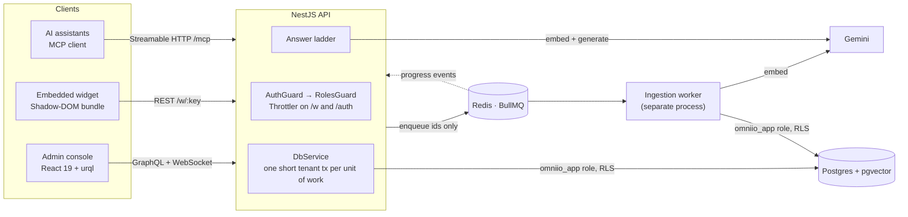
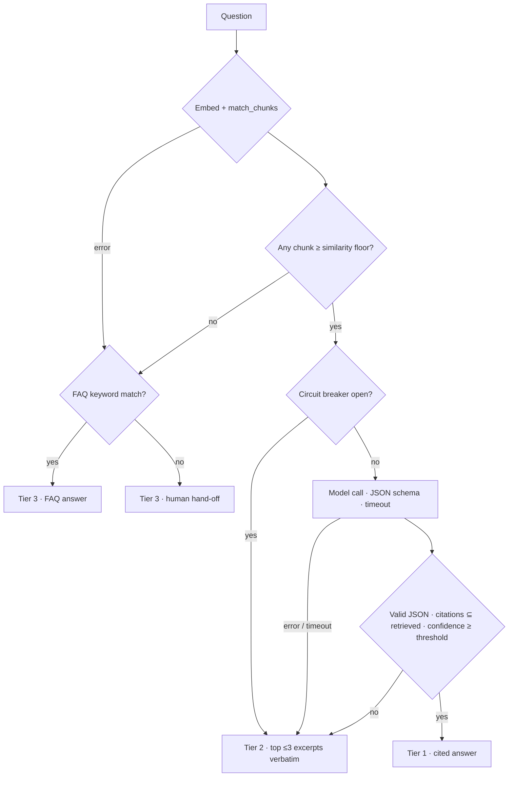

# Omni.io — Backend & Frontend Architecture Spec

Sep 28, 2026 (revised Sep 29, 2026 for v1.0.0) · @Jawad Ul Hadi

> Related: [resilience ladder](resilience-ladder.md) · [multi-tenancy](multi-tenancy.md) · [API](api.md) · [deployment](deployment.md) · [ADRs](adr/) · [scaffold review](reviews/2026-09-29-scaffold-review.md)

## 1. Why this version

The live `omniioo` repo was scaffolded with Lovable: fast to demo, but the stack (TanStack Start + Supabase-only) doesn't match the NestJS/PostgreSQL/GraphQL/BullMQ/Redis skill set the resume and case study lead with. This spec redesigns the same product — a multi-tenant AI support engine with a cited-answer → RAG-snippet → FAQ-floor resilience ladder — on a stack an interviewer can map directly onto "Backend Lead / Architect."

It reuses only the product concept and data-model ideas from the original. This repository implements everything described here. Where the implementation made a deliberate trade-off, this document says so, and the [ADRs](adr/) record why.

**Who this is for:** (1) a hiring-manager-facing architecture doc to accompany the "Designing for AI Failure" case study, and (2) a build brief — Section 9 is a single prompt that hands this spec to an AI coding tool.

## 2. System overview



One NestJS API serves CRUD, the console's GraphQL (including a live ingestion-progress subscription), the public widget, and MCP. **Ingestion is queued**; **answering is synchronous under a time budget.** The split is about failure semantics, not threads — Node doesn't block on I/O:

- Ingestion is long, retryable, and nobody is waiting on it, so it goes through BullMQ for durability, retries with backoff, and backpressure, in a separate worker process that can't starve the API of CPU, memory, or DB connections.
- Answering has a customer waiting. It runs inline with a hard timeout on the model call and a circuit breaker, so the worst case is a fast Tier 2 answer, never a queue.

## 3. Backend: NestJS modules

Each feature is a NestJS module with its own resolver/controller, service, and validated DTOs. Global guards run in a fixed order: `AuthGuard` verifies the JWT (or, on `/mcp` only, a personal access token) and fills a request-scoped tenant context (AsyncLocalStorage); `RolesGuard` then checks `@Roles(min)` against the caller's **current** row in `workspace_members`.

| Module | Responsibility | Key interfaces |
| --- | --- | --- |
| `AuthModule` | Email/password + Google OAuth (PKCE); 15-min JWT access tokens; opaque, rotating refresh tokens; optional closed sign-up (invite links only) | REST: `/auth/login`, `/auth/register`, `/auth/refresh`, `/auth/switch-workspace`, `/auth/logout`, `/auth/google` |
| `ApiTokensModule` | Personal access tokens for MCP clients, stored hashed, revocable, optionally expiring | GraphQL `apiTokens`, `createApiToken`, `revokeApiToken` |
| `WorkspacesModule` | Tenant CRUD, members and roles (owner/admin/editor/viewer), single-use invite links, ladder settings | GraphQL: `workspace`, `myWorkspaces`, `createInvitation`, `acceptInvitation`, `updateMemberRole`, `updateLadderSettings` |
| `DocumentsModule` | Upload (PDF/TXT/MD ≤ 20 MB), paste, visibility, GDPR erasure | REST `POST /documents/upload`; GraphQL `documents`, `createDocumentFromText`, `deleteDocument` |
| `IngestionModule` | Enqueues jobs; relays worker progress | BullMQ producer; GraphQL subscription `ingestionProgress` |
| Ingestion worker | Separate process: chunks (1,200 chars / 200 overlap, word-aligned), batch-embeds, idempotent upsert by `${documentId}:${chunkIndex}`, deletes stale tail chunks | BullMQ consumer |
| `AnswerModule` | The resilience ladder (Section 5) | GraphQL `askQuestion` |
| `FaqModule` | Deterministic Tier 3 floor, whole-word keyword match in SQL | GraphQL CRUD |
| `WidgetModule` | Public endpoint scoped by a rotating widget key; theme; key rotation | REST `/w/:key/config`, `/w/:key/ask`; GraphQL `widgetConfig`, `rotateWidgetKey` |
| `AuditModule` | Persists every answer: tier, model, tokens (including rejected Tier 1 attempts), retrieved and cited chunks, FAQ match, decision trace | Internal event listener (`answer.completed`); read-only GraphQL `answers` |
| `McpModule` | `list_workspaces`, `list_documents`, `list_faqs`, `ask_question` under the calling user's own membership and RLS scope | MCP over Streamable HTTP at `/mcp` |

**Cross-cutting:**

- A global `ValidationPipe` (`whitelist`, `forbidNonWhitelisted`) with class-validator DTOs on every input.
- An env schema validated at boot, so bad config fails fast.
- `AllExceptionsFilter`: returns a sanitized `GraphQLError` for GraphQL and a JSON body for REST, and never leaks stack traces.

## 4. Data model

Every tenant-owned table carries `workspace_id` and a policy of the form `USING / WITH CHECK (workspace_id = nullif(current_setting('app.workspace_id', true), '')::uuid)`. Migrations are plain, forward-only SQL files (`backend/migrations/`) applied by a ~60-line runner — RLS policies, `SECURITY DEFINER` functions, and pgvector's `SET` options are first-class SQL, so an ORM would only add a layer to see through.

| Table | Purpose | Notable columns |
| --- | --- | --- |
| `workspaces` | Tenant root | `id`, `name`, `plan`, `widget_key` (single source of truth), `confidence_threshold`, `similarity_floor` |
| `workspace_members` | Role binding | `workspace_id`, `user_id`, `role` |
| `users` | Identity (not tenant-scoped) | `email`, `password_hash` (scrypt; not readable by the app role), `google_sub` |
| `refresh_tokens` | Rotating sessions | `token_hash`, `family_id`, `used_at`, `revoked_at` |
| `documents` | Source content | `status`, `source_type`, `visibility` (internal/public), `content`, `storage_key`, `error` |
| `chunks` | Embedded text | `id` (`${documentId}:${chunkIndex}`), `embedding vector(768)`, `embedding_model`, `content` |
| `faqs` | Deterministic floor | `question`, `answer`, `keywords[]` (normalized on write), `visibility` (internal/public) |
| `workspace_invitations` | Invite links | `token_hash`, `role`, `label`, `expires_at` (single-use) |
| `api_tokens` | MCP personal access tokens (user-scoped) | `token_hash`, `name`, `last_used_at`, `expires_at`, `revoked_at` |
| `answers` | Audit log | `tier`, `channel`, `model`, `tokens_in/out`, `retrieved_chunk_ids[]`, `cited_chunk_ids[]`, `confidence`, `top_similarity`, `decision_note`, `decision_trace jsonb`, `latency_ms` |
| `widget_configs` | Widget appearance | `theme`, `rotated_at` |

The embedding dimension is fixed at **768** (Gemini `gemini-embedding-2` / `gemini-embedding-001` with `outputDimensionality: 768`, re-normalized). `chunks.embedding_model` records which model produced each vector, so a provider change is detectable and re-embeddable.

`match_chunks(workspace_id, query_embedding, top_k, public_only)` runs vector search server-side:

- It filters by `workspace_id` inside the SQL, on top of RLS.
- For widget calls, it restricts to public documents.
- It uses an **HNSW** index with pgvector's iterative scan (`hnsw.iterative_scan = relaxed_order`). IVFFlat is avoided because it post-filters, so small tenants get fewer than k rows, and its centroids are meaningless when built on an empty table.
- When the iterative scan still comes back short (it stops after `hnsw.max_scan_tuples`), it searches that tenant exactly through the `workspace_id` index. That only happens for small tenants, where an exact search is cheap.

## 5. RAG pipeline & resilience ladder



The ladder is one service method that **never throws**. A failure at any rung degrades to the next one:

- an embedding outage
- a DB error
- a model timeout
- malformed output
- a hallucinated citation
- low confidence
- a failed audit write

Every step appends to a decision trace. The trace is returned to the console playground, written to the audit log, and never exposed to anonymous widget users.

**What "confident enough" means.** Tier 1 is accepted only when three independent signals agree:

1. Retrieval found passages above the workspace's similarity floor.
2. The model's schema-validated JSON cites only passage ids we actually sent.
3. The model's self-reported confidence clears the workspace threshold.

Self-reported confidence alone is poorly calibrated, so it is never the only gate. Both thresholds are per-workspace settings. The next step is an offline evaluation set of labeled questions per workspace, used to tune the thresholds from observed precision rather than intuition.

**Cost honesty.** Tokens from a Tier 1 attempt that was later rejected are still recorded, so the audit log reflects real spend.

## 6. Frontend architecture

React 19 + Vite + TypeScript + Tailwind v4 + shadcn/ui, with **urql** as the GraphQL client. The console is CRUD-shaped, and urql's document cache (invalidate by typename after a mutation) covers it at a fraction of Apollo's bundle and configuration.

The widget is a separate IIFE bundle (`widget.js`) that renders inside a **Shadow DOM**, so a customer's page never loads the console, and neither side's CSS leaks into the other.

| Area | Structure | Notes |
| --- | --- | --- |
| `src/console/routes/` | login, playground, documents, ingestion, faqs, members, widget, audit | Route-level code splitting (`React.lazy`) |
| `src/widget/` | `embed.tsx` (script-tag entry), `page.tsx` (hosted `/w/:key`), `WidgetApp.tsx` | Scoped entirely by the public key; absolute API URLs; ASCII-only bundle so pages without a UTF-8 charset render correctly |
| `src/lib/` | `auth.tsx`, `urql.tsx`, `gql.ts` | Access token held in memory only; refresh cookie is httpOnly; refreshes are single-flight in a tab and serialized across tabs (Web Locks), because refresh-token reuse revokes the session |
| `src/components/ingestion/` | Dropzone, live progress, retry | One `ingestionProgress` subscription shared by the whole console |
| `src/components/playground/` | Tier badge, citations, decision trace | Mirrors the audit log, so support staff see *why* an answer looked the way it did |
| `src/components/audit/` + route | Filterable table, tier distribution, token totals | Cost and quality review |

Every screen has a designed empty state and error state, rather than falling back to a generic spinner:

- an empty ingestion queue
- zero FAQs
- no public documents for the widget
- a widget key rotated mid-session
- rate-limited

## 7. Security, auth & multi-tenancy

**Isolation is enforced by Postgres, and the design makes it impossible to bypass by accident:**

- The app connects as `omniio_app`: not the table owner, not a superuser, `NOBYPASSRLS`. Superusers always bypass RLS, and owners do unless it is forced, so connecting as the migration user would silently make every policy decorative. Migrations run as a separate owner role.
- `DbService.tenant()` is the unit of work. It checks out one pooled connection, opens `BEGIN`, sets the workspace with `set_config('app.workspace_id', …, true)` (transaction-local, so it can't bleed into the next request on that connection), runs the queries, and commits. With no workspace in context it throws rather than running unscoped (fail closed).
- Policies wrap the setting in `nullif(…, '')`. After a transaction-local set, a pooled connection reads the setting back as `''`, not `NULL`, and `''::uuid` would error on every later unscoped query.
- A tenant transaction is never held across a model or embedding call, so a slow provider can't pin pool connections.
- Pre-tenant and cross-tenant operations (login, "which workspaces am I in", widget key → workspace, live role checks, invite links, the retention sweep) go through narrow `SECURITY DEFINER` functions. Each pins `search_path`, and `EXECUTE` is granted only to the app role.
- The app role has column-level grants on `users` and cannot `SELECT password_hash`.
- An integration test suite proves isolation against a real Postgres instance. It checks rows with no `WHERE` clause, cross-tenant inserts, updates and deletes, and vector search pointed at another tenant.

**Auth.**

- **Access tokens:** 15-minute JWTs with `typ: "access"`.
- **Refresh tokens:** opaque, stored as SHA-256 hashes, and rotated on every use. Presenting an already-rotated token revokes the whole token family (theft detection). They are delivered in an httpOnly, `SameSite=Strict` cookie scoped to `/auth`.
- **Google sign-in:** authorization code flow with PKCE and a state cookie. A Google identity is never linked to an existing password account by email: sign-up doesn't verify email ownership, so whoever registered the address first could be anyone.
- **Invitations:** single-use links, valid for 7 days, that the invitee must open and accept. They are bound to possession of the link rather than to an email address, for the same reason. With `ALLOW_SIGNUP=false`, an invite link is the only way to create an account.
- **API tokens:** `omni_pat_…` personal access tokens for MCP clients. They are stored as SHA-256, accepted only on `/mcp`, and act as their user with live membership checks.

**Roles.** `owner > admin > editor > viewer`, checked on every request against the live membership row, so demotion or removal takes effect immediately. Nobody can grant a role above their own, only owners can modify owners, and a workspace always keeps at least one owner.

**Prompt injection.** Uploaded documents and anonymous widget questions are both untrusted. Defenses:

- Retrieved passages go into delimited blocks, and delimiter-like text inside them is neutralized.
- The system prompt treats all context as data.
- Output is constrained to a JSON schema.
- Any citation that isn't a retrieved id rejects the answer, and so does an answer whose words its citations don't contain.
- The widget answers only from documents and FAQs explicitly marked **public**. Both are internal by default, so neither Tier 2 nor Tier 3 can publish internal content to anonymous visitors.

**Secrets.** Refresh tokens, invite links and API tokens are stored only as SHA-256 hashes; the plaintext is shown once.

**Widget.** The key is public by design (it sits in page source) and only permits asking questions against public documents. Rotation takes effect immediately and doesn't affect console sessions. CORS is open for `/w/*` without credentials; everything else is restricted to the console origin.

**Rate limiting and cost ceilings.** Limits are Redis-backed, so they hold across API instances. If Redis is unreachable they fall back to per-process counters instead of blocking requests.

- The widget is limited per IP and per workspace; login and refresh are limited per IP.
- Console and MCP questions are limited per user.
- Uploads are limited per workspace per hour.
- Model calls have a daily per-workspace budget, after which answers come from Tier 2.
- Workspaces per user are capped.
- Questions are capped at 1,000 characters, because every character costs model tokens.

**GDPR erasure.** One transaction deletes the document and its chunks and vectors, and scrubs its chunk ids from the audit log. The original file is deleted after commit, because a file store can't join a Postgres transaction; a failed delete is re-queued until it succeeds. Queue jobs carry only ids, so no document text lingers in Redis.

Stated limits:

- Backups age out on their own schedule.
- Text already sent to the model provider is governed by the provider's retention terms.
- `answers.query` holds customer-typed text. The worker deletes rows older than `ANSWER_RETENTION_DAYS` (default 90).

**MCP.** MCP runs over Streamable HTTP (HTTP+SSE is deprecated in the MCP spec), in stateless mode, authenticated with a personal access token (or the console's bearer JWT). Each tool checks the caller's membership of the requested workspace, then runs under that workspace's RLS scope. MCP OAuth 2.1 authorization is on the roadmap.

## 8. Operations & what's next

- **Observability:**
  - Tier-distribution and fallback-rate metrics with alerting — a rising Tier 2/3 share is the leading indicator of a provider or content problem.
  - Per-step latency from the decision trace, exported as OpenTelemetry spans.
- **Cost ceilings:** per-workspace daily token budgets that force Tier 2 when exhausted, in addition to request rate limits.
- **Shared circuit breaker:** today each API instance trips independently. A Redis-backed breaker would coordinate across instances.
- **Evaluation:** labeled question sets per workspace, and threshold tuning from measured precision and recall.
- **Codegen:** replace the hand-written GraphQL client types with graphql-codegen against the schema the API emits (`backend/schema.gql`).

## 9. Build prompt

Paste this into Claude Code, Cursor, or another agentic coding tool to scaffold the system from this spec.

```markdown
Build "Omni.io": a multi-tenant AI customer-support knowledge engine.

STACK
- Backend: NestJS (TypeScript), GraphQL (code-first, @nestjs/graphql + Apollo), PostgreSQL + pgvector, plain SQL migrations with a small runner, Redis, BullMQ.
- Frontend: React 19 + Vite + TypeScript, Tailwind CSS v4, shadcn/ui, urql.
- LLM + embeddings: Google Gemini (768-dim embeddings), behind a provider interface with a deterministic fake for tests.
- Auth: short-lived JWT access tokens + opaque rotating refresh tokens in an httpOnly cookie; email/password and Google OAuth (PKCE).

CORE PRODUCT
Each workspace (tenant) uploads documents (PDF/txt/md up to 20MB) or pastes text. A separate worker process chunks (1,200 chars, 200 overlap, word-aligned, stable id "${documentId}:${chunkIndex}", idempotent upsert, delete stale tail chunks), batch-embeds, and stores vectors in pgvector (HNSW). Jobs carry ids only.

When a customer asks a question, run a 3-tier resilience ladder as ONE service method that never throws:
1. Tier 1 — retrieve top-k chunks; if any clear the workspace similarity floor, ask the LLM (hard timeout, circuit breaker) for schema-constrained JSON { answer, citedChunkIds, confidence }; accept only if it parses, every cited id was retrieved, and confidence >= the workspace threshold.
2. Tier 2 — on model error, timeout, invalid output or low confidence: return up to 3 retrieved chunks above the floor, verbatim.
3. Tier 3 — if retrieval fails or nothing clears the floor: deterministic whole-word FAQ keyword match, else a human hand-off message.
Record a step-by-step decision trace. Emit an event per answer; an audit listener stores tier, channel, model, tokens (including rejected Tier 1 attempts), retrieved and cited chunk ids, FAQ match, and the trace. An audit failure must never affect the answer.

MULTI-TENANCY & SECURITY (non-negotiable)
- Every tenant table has workspace_id and an RLS policy using nullif(current_setting('app.workspace_id', true), '')::uuid, with USING and WITH CHECK.
- The app connects as a non-owner, non-superuser, NOBYPASSRLS role. Migrations run as the owner.
- Every DB unit of work is a short transaction that sets app.workspace_id with set_config(..., true) from request-scoped context; throw if no workspace is set. Never hold a transaction across an LLM call.
- Pre-tenant and cross-tenant operations (login, user's workspaces, widget key, live role, invite links, retention) go through SECURITY DEFINER functions with a pinned search_path.
- Roles owner/admin/editor/viewer are checked against the live membership row on every request; no granting above your own role; owners protected.
- Connector keys use AES-256-GCM with the row identity as AAD.
- GDPR erasure: one transaction deletes the document, chunks and audit references; the file is deleted after commit, with retry.
- Treat retrieved passages and widget questions as untrusted (delimited context, schema output, citation validation). The widget only sees documents marked public.

FEATURES
- Upload + ingestion with live progress (GraphQL subscription) and retry.
- Admin console: documents, ingestion, playground (tier badge, citations, decision trace, ladder settings), FAQs, members, widget config + key rotation + embed snippet, answer audit with tier distribution.
- Public widget as a separate Shadow-DOM bundle plus a hosted page at /w/:key; Redis-backed rate limits per IP and per workspace.
- MCP server (Streamable HTTP) with list_workspaces, list_documents, list_faqs and ask_question, under the calling user's scope.

DELIVERABLES
- Working backend and frontend, SQL migrations (RLS, definer functions, match_chunks), unit tests for every ladder branch, a real-Postgres RLS integration test, and a README covering setup, env vars, and how the ladder degrades.
```
