# Omni.io — System Architecture

**AI customer support that degrades gracefully instead of failing.** Multi-tenant RAG on NestJS, PostgreSQL row-level security + pgvector, BullMQ, Gemini and React.

Jawad Ul Hadi · Backend Lead & Architect · October 2026 · v1.0.0 + unreleased deployment hardening

Source: [github.com/JawadulHadi/omni-io](https://github.com/JawadulHadi/omni-io) · Case study: *Designing for AI Failure* · [ADRs](https://github.com/JawadulHadi/omni-io/tree/main/docs/adr)

---

## Contents

1. [The problem and the design principle](#1-the-problem-and-the-design-principle)
2. [System context](#2-system-context)
3. [Runtime containers](#3-runtime-containers)
4. [Backend module map](#4-backend-module-map)
5. [Request pipeline](#5-request-pipeline)
6. [The resilience ladder](#6-the-resilience-ladder)
7. [Asking a question, end to end](#7-asking-a-question-end-to-end)
8. [Ingestion pipeline](#8-ingestion-pipeline)
9. [Data model](#9-data-model)
10. [Tenant isolation](#10-tenant-isolation)
11. [Authentication and sessions](#11-authentication-and-sessions)
12. [Public widget](#12-public-widget)
13. [MCP server for AI assistants](#13-mcp-server-for-ai-assistants)
14. [Deployment topology](#14-deployment-topology)
15. [Failure matrix](#15-failure-matrix)
16. [Technology stack and decisions](#16-technology-stack-and-decisions)

---

## 1. The problem and the design principle

Most RAG systems have one mode: working. If the embedding API is down, the model times out, or the model cites a passage it never saw, the customer gets either an error or a confident fabrication.

Omni.io follows three rules:

| Rule | How it is enforced |
| --- | --- |
| **Every question gets an answer** | A three-tier ladder in one service method that never throws: cited AI answer → verbatim excerpts → FAQ or human hand-off |
| **Every answer explains itself** | A step-by-step decision trace, stored in the audit log and shown to support staff |
| **Tenants can't see each other's data, even through a bug** | Postgres row-level security under a `NOBYPASSRLS` role, tested against a real database |

---

## 2. System context

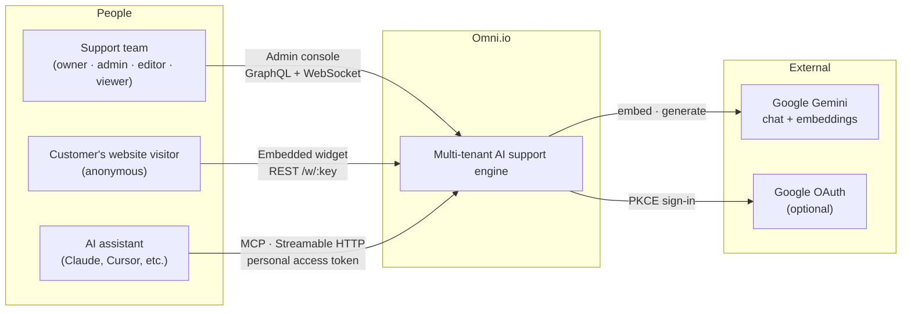

There are three ways in, each with its own trust level:

| Channel | Caller | Authentication | What it can see |
| --- | --- | --- | --- |
| Console | Workspace members | 15-minute JWT + rotating refresh cookie | Everything their role allows |
| Widget | Anonymous visitors | Public, rotatable widget key | Only documents and FAQs marked **public** |
| MCP | AI assistants acting for a user | `omni_pat_…` personal access token | Exactly what that user can see |

---

## 3. Runtime containers

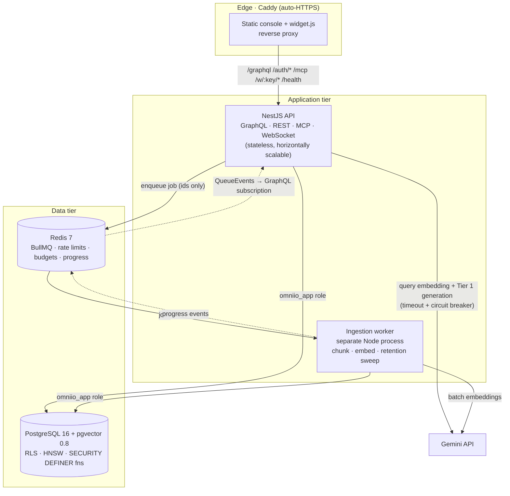

**Why ingestion is queued but answering is synchronous.** The split follows failure semantics, not threading:

- **Ingestion** is long and retryable, and nobody is waiting on it. BullMQ gives durability, retries with backoff, and backpressure. A separate process means a 20 MB PDF can't starve the API of CPU, memory or DB connections.
- **Answering** has a customer waiting. It runs inline under a hard time budget with circuit breakers. The worst case is a fast Tier 2 answer, never a queue.

---

## 4. Backend module map

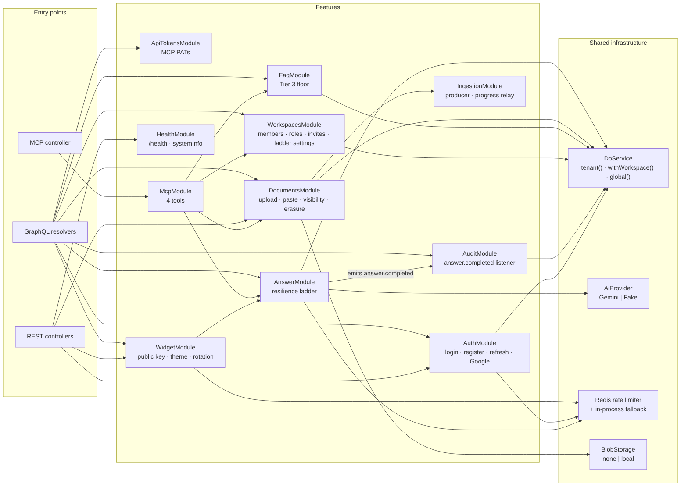

| Module | Main operations |
| --- | --- |
| `AuthModule` | `POST /auth/login · /register · /refresh · /switch-workspace · /logout · /google` |
| `ApiTokensModule` | `apiTokens`, `createApiToken`, `revokeApiToken` |
| `WorkspacesModule` | `workspace`, `myWorkspaces`, `createInvitation`, `acceptInvitation`, `updateMemberRole`, `updateLadderSettings` |
| `DocumentsModule` | `POST /documents/upload`, `documents`, `createDocumentFromText`, `deleteDocument` |
| `IngestionModule` | BullMQ producer, `ingestionProgress` subscription |
| `AnswerModule` | `askQuestion` |
| `FaqModule` | FAQ CRUD |
| `WidgetModule` | `GET /w/:key/config`, `POST /w/:key/ask`, `widgetConfig`, `rotateWidgetKey` |
| `AuditModule` | Internal listener; read-only `answers` |
| `McpModule` | `POST /mcp`: `list_workspaces`, `list_documents`, `list_faqs`, `ask_question` |

---

## 5. Request pipeline

Every request passes the same gates in a fixed order. No feature code can skip them.

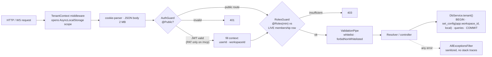

Roles are checked against the **live** `workspace_members` row on every request, not against JWT claims. A demotion or removal takes effect on the next request, not when the token expires.

---

## 6. The resilience ladder

One method, `AnswerService.askQuestion()`, never throws. Every branch appends to the decision trace.

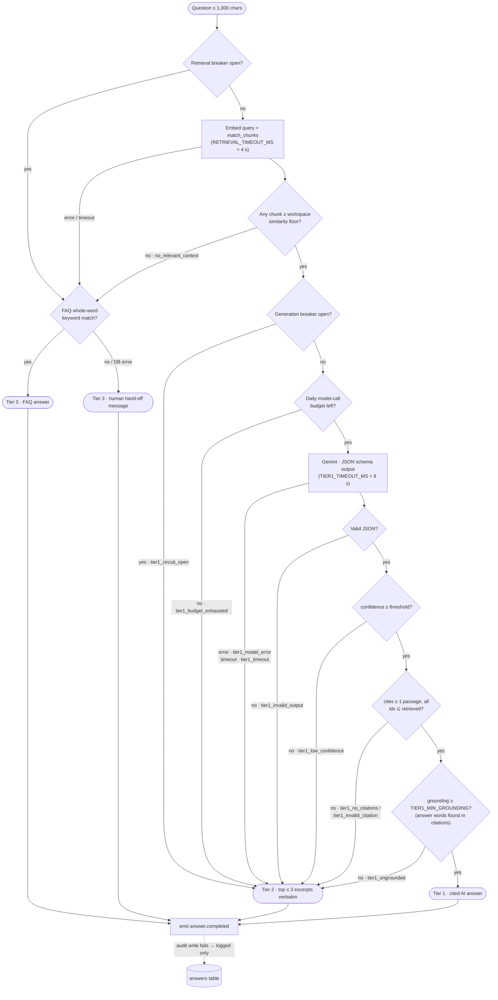

**What "confident enough" means.** Tier 1 needs four independent checks to pass:

1. **Retrieval:** at least one passage clears the per-workspace similarity floor (default 0.6).
2. **Structure:** the output is schema-valid JSON `{ answer, citedChunkIds, confidence }`.
3. **Provenance:** every cited id was actually sent to the model.
4. **Calibration + grounding:** self-reported confidence clears the threshold, *and* enough of the answer's content words appear in the cited text.

Self-reported confidence is poorly calibrated, so it is never the only gate.

**Cost honesty.** Tokens spent on a Tier 1 attempt that was later rejected are still recorded, so the audit log reflects real spend.

### Circuit breaker states

There is one breaker per dependency, so an embedding outage and a chat-model outage trip independently.

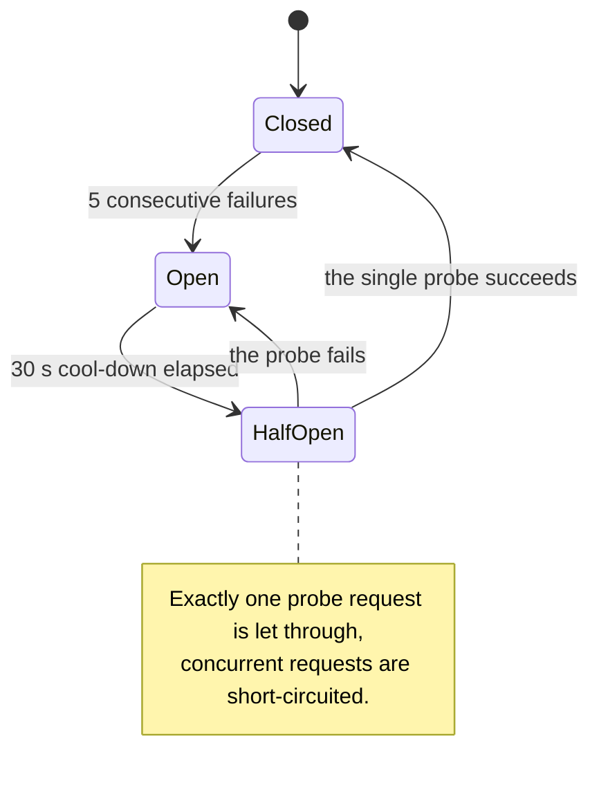

---

## 7. Asking a question, end to end

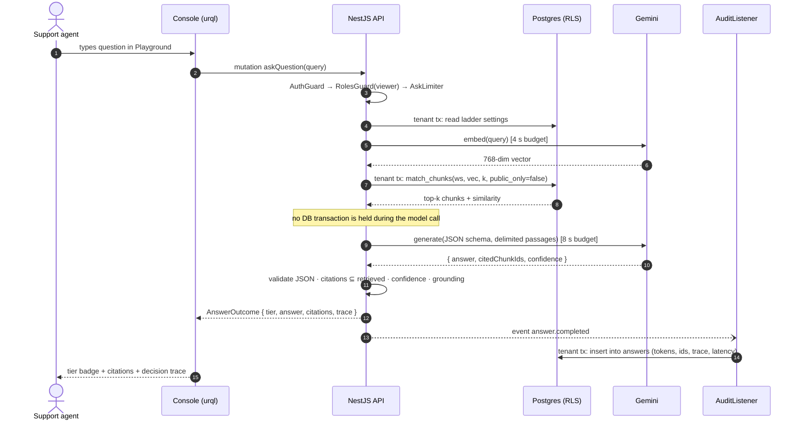

---

## 8. Ingestion pipeline

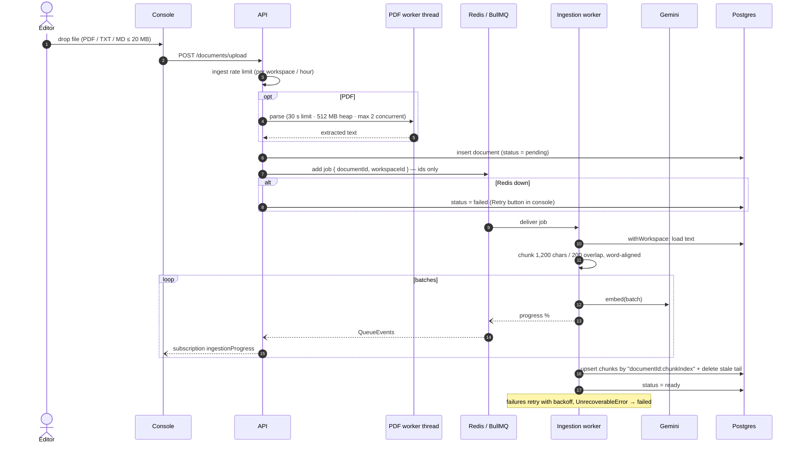

**Idempotency.** Chunk ids are deterministic (`${documentId}:${chunkIndex}`), so a retried job overwrites rather than duplicates. Stale tail chunks from a shorter re-ingest are deleted in the same transaction.

**Retention sweep.** Every six hours the worker calls `run_retention()`. It deletes answer-audit rows older than `ANSWER_RETENTION_DAYS` (default 90), plus expired invitations, refresh tokens and API tokens.

---

## 9. Data model

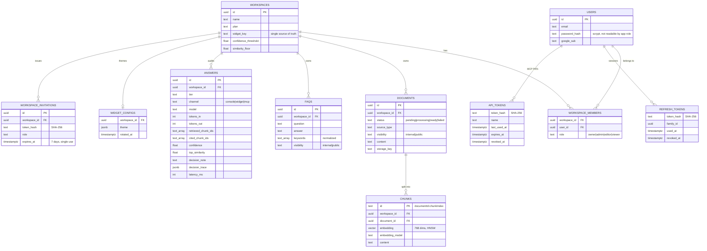

**Vector search.** `match_chunks(workspace_id, query_embedding, top_k, public_only)` runs server-side:

- It filters by `workspace_id` inside the SQL, on top of RLS.
- It uses an HNSW index with `hnsw.iterative_scan = relaxed_order`. IVFFlat would post-filter, so small tenants would get fewer than k rows.
- If the iterative scan still comes back short, it falls back to an exact search for that tenant only, which is cheap for small tenants.

Migrations are plain, forward-only SQL files (`0001_init` → `0004_hardening`), applied by a ~60-line runner under an advisory lock.

---

## 10. Tenant isolation

Isolation is enforced in Postgres, in layers, so that no single application bug can cross tenants.

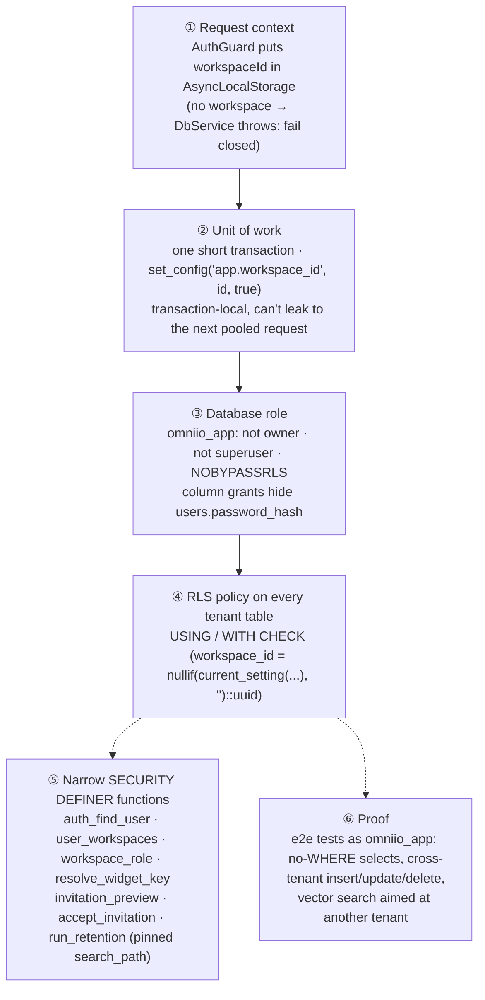

**Why `nullif(…, '')`?** After a transaction-local `set_config`, a pooled connection reads the setting back as `''`, not `NULL`, and `''::uuid` raises an error on every later unscoped query.

**Why no transaction across model calls?** A slow LLM would pin pool connections. Each unit of work holds a connection for milliseconds.

---

## 11. Authentication and sessions

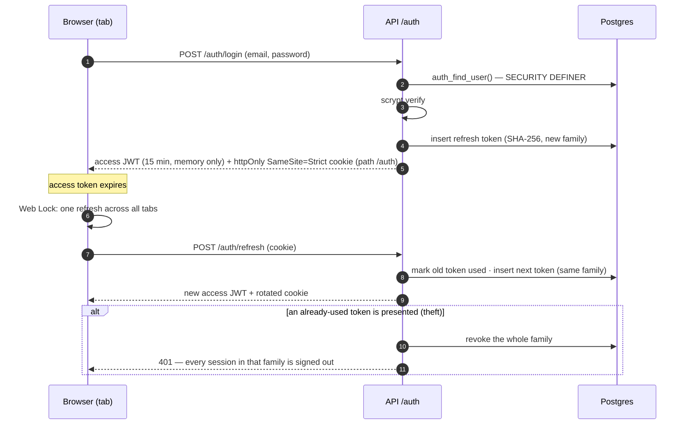

| Concern | Decision |
| --- | --- |
| Access token | 15-minute JWT with `typ: "access"`, held in memory only |
| Refresh token | Opaque, SHA-256 at rest, rotated on every use, reuse revokes the whole family |
| Google sign-in | Authorization code + PKCE + state cookie. **Never** auto-linked to an existing password account by email, because sign-up doesn't verify email ownership |
| Invitations | Single-use links valid for 7 days, bound to possession of the link. With `ALLOW_SIGNUP=false` they are the only way to create an account |
| Roles | `owner > admin > editor > viewer`. Nobody can grant above their own role, only owners can modify owners, and there is always ≥ 1 owner |
| Production boot guard | The API refuses to start with `COOKIE_SECURE=false` or the example `JWT_SECRET` |

---

## 12. Public widget

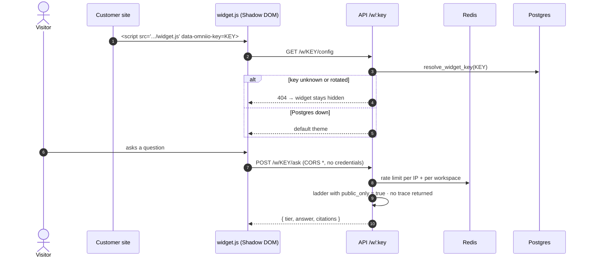

- **Isolation from the host page:** the widget renders in a Shadow DOM, ships as a separate ~72 kB gzipped IIFE bundle, and is ASCII-only so it works on pages without a UTF-8 charset.
- **Data exposure:** it answers only from public documents and FAQs. Both are internal by default, so Tier 2 and Tier 3 can't leak internal content to anonymous visitors.
- **Key rotation:** takes effect immediately and doesn't affect console sessions.

---

## 13. MCP server for AI assistants

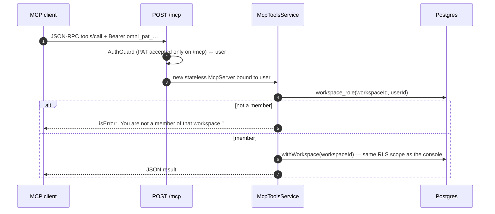

| Tool | Input | Effect |
| --- | --- | --- |
| `list_workspaces` | — | Read-only: the caller's memberships and roles |
| `list_documents` | `workspaceId` | Read-only: documents with ingestion status |
| `list_faqs` | `workspaceId` | Read-only: Tier 3 FAQ entries |
| `ask_question` | `workspaceId`, `query` (≤ 1,000 chars) | Runs the ladder. It calls Gemini, writes an audit row and is rate-limited per user |

Every tool declares a title, an input schema and all four MCP annotation hints (`readOnlyHint`, `destructiveHint`, `idempotentHint`, `openWorldHint`), so clients can warn before a tool with side effects runs.

The transport is Streamable HTTP in stateless mode (HTTP+SSE is deprecated in the MCP spec), so there are no sessions to store or scale. OAuth 2.1 is on the roadmap.

---

## 14. Deployment topology

The reference deployment is one server running Docker Compose. The same images run unchanged on container platforms.

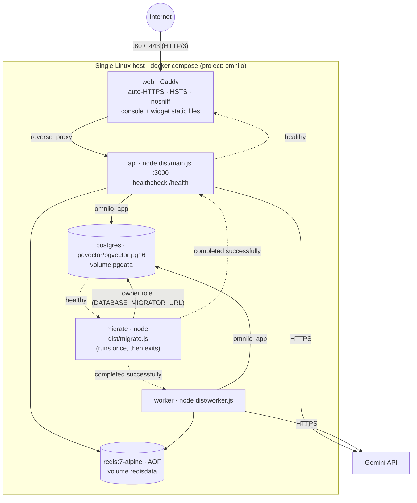

**Start-up order:** Postgres becomes healthy → `migrate` runs as the schema owner and exits 0 → the API and worker start as `omniio_app` → Caddy starts once the API is healthy.

**Scaling path:**

| Component | Scales | Note |
| --- | --- | --- |
| API | Horizontally | Stateless apart from in-process circuit breakers |
| Worker | Horizontally | BullMQ distributes jobs; `concurrency: 2` per process |
| Postgres | Vertically + read replicas | Managed options need pgvector ≥ 0.8 for `hnsw.iterative_scan` |
| Redis | Managed instance | Holds only queues and counters, no source data |
| Console / widget | CDN | Same-site with the API, because the refresh cookie is `SameSite=Strict` |

---

## 15. Failure matrix

| Dependency fails | Detection | Customer gets | Recorded as |
| --- | --- | --- | --- |
| Gemini chat model errors | exception | Tier 2 excerpts | `tier1_model_error` |
| Gemini chat model hangs | 8 s `AbortSignal` | Tier 2 excerpts | `tier1_timeout` |
| Repeated model failures | breaker open | Tier 2, no model call | `tier1_circuit_open` |
| Model returns bad JSON | schema parse | Tier 2 | `tier1_invalid_output` |
| Model invents a citation | ids ⊄ retrieved | Tier 2 | `tier1_invalid_citation` |
| Answer not supported by its citations | grounding ratio | Tier 2 | `tier1_ungrounded` |
| Daily budget spent | Redis counter | Tier 2 | `tier1_budget_exhausted` |
| Embedding API down or slow | exception / 4 s budget / breaker | Tier 3 FAQ or hand-off | `retrieval_failed` / `retrieval_timeout` / `retrieval_circuit_open` |
| Nothing relevant indexed | similarity floor | Tier 3 | `no_relevant_context` |
| Audit write fails | listener catch | Same answer | logged only |
| Redis down | client error | Same answers; per-process rate limits; uploads saved as `failed` + Retry | `/health` → `degraded` |
| Postgres down | client error | Widget: hand-off message + default theme | `/health` → 503 |
| PDF bomb or slow parse | worker-thread limits | Upload rejected; API stays responsive | document `error` |

---

## 16. Technology stack and decisions

| Layer | Stack |
| --- | --- |
| API | NestJS 12, GraphQL (Apollo 5, code-first), REST, MCP SDK, zod, class-validator |
| Data | PostgreSQL 16, pgvector 0.8 (HNSW + iterative scan), RLS, plain SQL migrations |
| Jobs | BullMQ 6 on Redis 7, separate worker process |
| AI | Gemini `gemini-3.5-flash` + `gemini-embedding-2` (768 dims) behind an `AiProvider` interface, plus a deterministic fake with failure injection |
| Console | React 19, Vite 8, React Router 7, Tailwind v4, shadcn/ui, urql, graphql-ws |
| Widget | Standalone React IIFE bundle in a Shadow DOM |
| Delivery | Docker (Node 24 LTS), Caddy, GitHub Actions (typecheck, unit, RLS e2e on real pgvector, image builds), Dependabot |

| ADR | Decision |
| --- | --- |
| [0001](https://github.com/JawadulHadi/omni-io/blob/main/docs/adr/0001-tenant-isolation-in-postgres.md) | Tenant isolation in Postgres, not application code |
| [0002](https://github.com/JawadulHadi/omni-io/blob/main/docs/adr/0002-short-tenant-transactions.md) | One short tenant transaction per unit of work |
| [0003](https://github.com/JawadulHadi/omni-io/blob/main/docs/adr/0003-plain-sql-migrations.md) | Plain SQL migrations instead of an ORM |
| [0004](https://github.com/JawadulHadi/omni-io/blob/main/docs/adr/0004-sync-answers-queued-ingestion.md) | Synchronous answers, queued ingestion |
| [0005](https://github.com/JawadulHadi/omni-io/blob/main/docs/adr/0005-model-output-is-untrusted.md) | Model output is untrusted input |
| [0006](https://github.com/JawadulHadi/omni-io/blob/main/docs/adr/0006-rotating-refresh-tokens.md) | Rotating refresh tokens with reuse detection |
| [0007](https://github.com/JawadulHadi/omni-io/blob/main/docs/adr/0007-urql-and-a-separate-widget-bundle.md) | urql and a separate widget bundle |
| [0008](https://github.com/JawadulHadi/omni-io/blob/main/docs/adr/0008-mcp-streamable-http.md) | MCP over Streamable HTTP, stateless, under the caller's scope |

---

*Source code, ADRs and full documentation: [github.com/JawadulHadi/omni-io](https://github.com/JawadulHadi/omni-io).*
