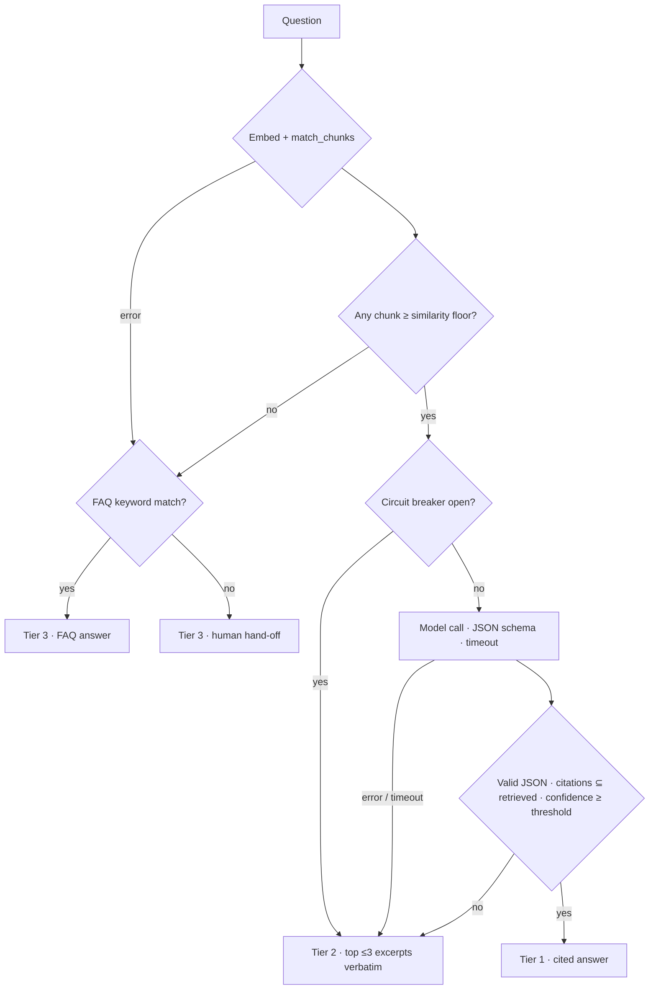

# The resilience ladder

The ladder is the core promise of Omni.io: **every question gets an answer, and the answer is never worse than it has to be.** When the model, the embedding API or the database misbehaves, quality steps down one rung instead of the customer seeing an error.

The whole ladder is one method, [`AnswerService.askQuestion`](../backend/src/modules/answer/answer.service.ts), and it never throws. The only exception is a call made with no tenant in context, which is a programming error, not a runtime failure.



## The rungs

| Tier | Name | What the customer gets | Depends on |
| --- | --- | --- | --- |
| 1 | `ai_answer` | A model-written answer and the passages it cites | Embeddings, vector search, the chat model |
| 2 | `rag_snippets` | Up to three retrieved passages, verbatim | Embeddings, vector search |
| 3 | `faq_floor` | A keyword-matched FAQ answer, or a human hand-off message | Postgres only, or nothing at all |

Each tier removes one dependency. Tier 3's hand-off message needs nothing, not even the database.

## Step by step

1. **Load ladder settings.** The per-workspace `confidence_threshold` (default 0.75) and `similarity_floor` (default 0.6). If this read fails, the defaults are used and the trace records it.
2. **Retrieve.** Embed the question (`RETRIEVAL_QUERY`) and call `match_chunks` for the top 5 chunks. Widget calls pass `public_only = true`. Any error here (embedding outage, DB error) goes straight to Tier 3 with `retrieval_failed`.
3. **Similarity floor.** Only chunks at or above the floor count as relevant. If none do, no model call is made — there is nothing to ground an answer in — and the question goes to Tier 3 with `no_relevant_context`.
4. **Circuit breaker.** After 5 consecutive model failures, Tier 1 is skipped for 30 seconds. Customers get Tier 2 immediately instead of each waiting out the timeout. After the cooldown one request is let through (half-open).
5. **Tier 1 generation.** The model gets only the relevant chunks, in delimited `<passage id="…">` blocks. Output is constrained to `{ answer, citedChunkIds, confidence }`. The call is raced against `TIER1_TIMEOUT_MS`, so the budget holds even if the provider SDK ignores the abort signal.
6. **Tier 1 validation.** The answer is accepted only if all of these hold:
   - it parses against a zod schema (`confidence` must be a number — the string `"0.9"` is rejected)
   - its confidence is at or above the threshold
   - it cites at least one passage
   - **every cited id is one of the passages actually sent**
7. **Tier 2.** On any Tier 1 failure, return the top ≤3 relevant chunks verbatim.
8. **Tier 3.** Match the question against FAQ keywords. These are normalized on write and matched as whole words or phrases in SQL, and the most keyword hits wins. If nothing matches or the lookup fails, return the hand-off message.
9. **Audit.** Emit `answer.completed`. The audit listener writes the row off the response path, so a failed audit write can never demote or break an answer.

## Why "confident enough" uses three signals

A model's self-reported confidence is poorly calibrated, so it is never the only gate. Tier 1 needs three independent signals to agree:
- **retrieval** found passages above the floor
- the **citations** are verifiably grounded in them
- the **self-score** clears the threshold

Both thresholds are per-workspace settings (Playground → Ladder settings, admin and above). The planned next step is a labeled evaluation set per workspace, so the thresholds are tuned from measured precision rather than intuition.

## Decision notes

Every answer stores why it ended where it did in `answers.decision_note`:

| `decision_note` | Meaning | Tier |
| --- | --- | --- |
| `tier1_accepted` | All Tier 1 gates passed | 1 |
| `tier1_model_error` | The provider threw (rate limit, 5xx, network) | 2 |
| `tier1_timeout` | The provider exceeded `TIER1_TIMEOUT_MS` | 2 |
| `tier1_circuit_open` | Skipped: too many recent model failures | 2 |
| `tier1_invalid_output` | The output wasn't valid JSON for the schema | 2 |
| `tier1_low_confidence` | Confidence was below the workspace threshold | 2 |
| `tier1_no_citations` | The answer cited nothing | 2 |
| `tier1_invalid_citation` | The answer cited a passage it was never given | 2 |
| `no_relevant_context` | Nothing cleared the similarity floor | 3 |
| `retrieval_failed` | Embedding or vector search failed | 3 |

## The decision trace

Each step is recorded with an outcome (`ok`, `rejected`, `failed`, `skipped`), a short detail, and the milliseconds since the previous step. The trace never contains document text.

```json
[
  { "step": "load_settings",    "outcome": "ok",       "detail": "threshold 0.75, floor 0.60", "ms": 3 },
  { "step": "retrieve",         "outcome": "ok",       "detail": "5 chunks, top similarity 0.82", "ms": 41 },
  { "step": "similarity_floor", "outcome": "ok",       "detail": "3 of 5 chunks >= 0.60", "ms": 0 },
  { "step": "tier1_generate",   "outcome": "ok",       "detail": "gemini-3.5-flash: 912 in / 88 out tokens", "ms": 1240 },
  { "step": "tier1_validate",   "outcome": "rejected", "detail": "cites 1 chunk id(s) that were never retrieved", "ms": 0 },
  { "step": "tier2_snippets",   "outcome": "ok",       "detail": "returning 3 excerpt(s) verbatim", "ms": 0 }
]
```

The console playground and the audit log both render it. The widget never shows it.

**Cost honesty.** When a Tier 1 answer is rejected, its model name and token counts are still recorded on the row, so spend in the audit log is real.

## Forcing failures (demo and testing)

With `AI_PROVIDER=fake`, include a marker in a question:

| Marker | Simulates | Expected result |
| --- | --- | --- |
| `[fail:error]` | A 503 from the model API | Tier 2, `tier1_model_error` |
| `[fail:timeout]` | A model that never responds | Tier 2 after `TIER1_TIMEOUT_MS`, `tier1_timeout` |
| `[fail:json]` | Prose instead of JSON | Tier 2, `tier1_invalid_output` |
| `[fail:lowconf]` | Confidence 0.2 | Tier 2, `tier1_low_confidence` |
| `[fail:cite]` | A citation of a non-existent chunk | Tier 2, `tier1_invalid_citation` |

Every branch is also covered by unit tests in [`answer.service.spec.ts`](../backend/src/modules/answer/answer.service.spec.ts).
