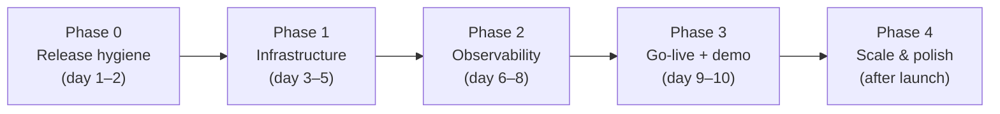
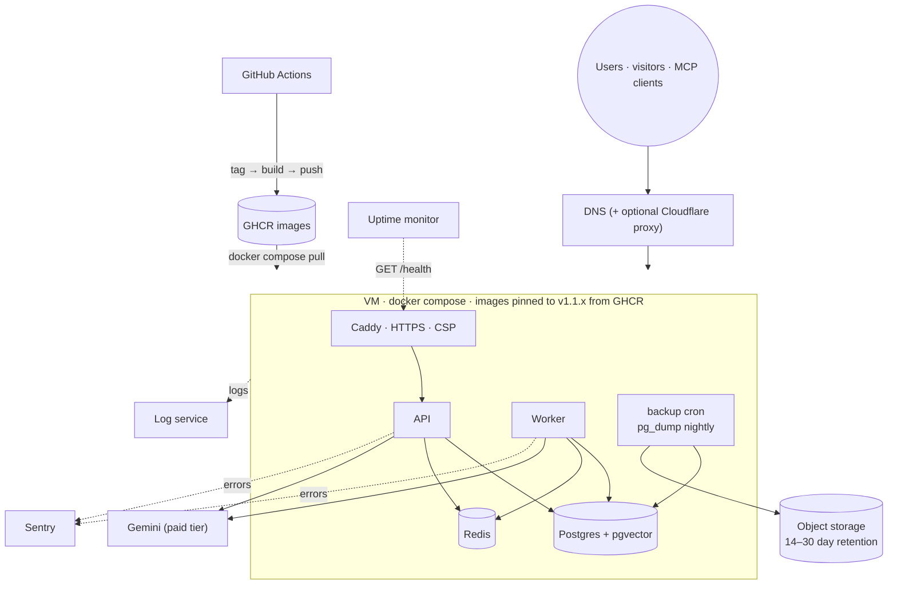

# Omni.io — Architecture Review & Path to Production

Review date: 2 October 2026 · Reviewed at commit `c1e1f77` (`main`, after PR #11 "deploy readiness")

Scope:

- The repository [JawadulHadi/omni-io](https://github.com/JawadulHadi/omni-io).
- The *Backend & Frontend Architecture Spec* (.docx, 28 Sept 2026).
- The M8ven Trust Index listing and notification email (29 Sept / 2 Oct 2026).

The diagrams are in [System Architecture](../gist/omni-io-architecture.md), the public gist document. This review is the internal companion to it and is not part of the gist.

---

## 1. Verdict

| Area | Rating | Summary |
| --- | --- | --- |
| Architecture | **Strong** | Clear failure semantics (sync answers, queued ingestion) and a ladder that never throws. Isolation is enforced in Postgres, not by convention |
| Security design | **Strong** | NOBYPASSRLS app role, rotating refresh tokens with reuse detection, no email-based account linking, public/internal visibility on widget content, model output treated as untrusted |
| Code quality | **Good** | Small, focused modules (largest service ~330 lines). Typecheck passes. Decisions are documented in eight ADRs |
| Test coverage | **Good, with gaps** | Ladder, breakers, chunking, auth guard and prompt are unit-tested. RLS, invitations and retention run e2e against a real pgvector. The MCP tool layer has **no tests** |
| Documentation | **Good, with drift** | The repo docs are current. The .docx spec predates the implementation and contradicts it in six places (§3) |
| Production readiness | **Not yet** | Deployable in one command, but there are no backups, no error tracking or metrics, no published images, no tagged release containing the security fixes, and no live environment |

**Bottom line:** the engineering is ahead of the operations. The code is ready for a first production deployment. What's missing is the ops around it: backups, monitoring, a release, and a real domain.

---

## 2. What is working well

1. **The ladder is one method that never throws.** Thirteen named failure reasons (`tier1_timeout`, `tier1_invalid_citation`, `retrieval_circuit_open`, …) each map to a defined customer outcome. A failed audit write never changes the answer.
2. **Four independent gates guard Tier 1:** similarity floor, schema-valid JSON, citations ⊆ retrieved ids, and a confidence + grounding check. Self-reported confidence is never trusted on its own.
3. **Tenant isolation can't be bypassed by accident.**
   - The app role is not the owner, not a superuser, and `NOBYPASSRLS`.
   - The workspace is set transaction-locally, and `nullif` protects the policies from the pooled `''` setting.
   - DbService fails closed when no workspace is set.
   - Cross-tenant work goes through narrow `SECURITY DEFINER` functions.
   - All of this is proven by e2e tests run *as the app role*.
4. **No transaction is held across an LLM call**, so a slow provider can't exhaust the pool.
5. **Each dependency fails on its own terms:**
   - Redis down: degraded, not down.
   - Postgres down: the widget still shows the hand-off message.
   - PDF parsing runs in a capped worker thread.
6. **Cost ceilings are built in:** a daily model-call budget per workspace (Tier 2 after it, not errors), plus per-user, per-IP, per-workspace and upload limits.
7. **Honest artifacts.** The 47-finding scaffold review is published, and so are the ADRs and the changelog. That is senior-level signal for a portfolio project.

---

## 3. Findings

Severity: 🔴 must fix before production · 🟠 fix soon · 🟡 improvement · ✅ fixed in this review

### 3.1 Documentation

| # | Sev | Finding | Action |
| --- | --- | --- | --- |
| D1 | ✅ | The spec (both the .docx and `docs/ARCHITECTURE.md`) opened by comparing the project to an earlier no-code scaffold | Removed. Both now open with a neutral product overview |
| D2 | 🟠 | The .docx spec no longer matches the code: **Drizzle** (code uses plain SQL migrations) · **TenantInterceptor** (code uses AsyncLocalStorage + `DbService.tenant()`) · **MCP over SSE** (code uses Streamable HTTP) · **AES-256-GCM connector keys** (removed as unused) · **`inviteMember`** (replaced by single-use invite links) · **"urql or Apollo", Zustand** (urql chosen, no Zustand) | Use the repo `docs/ARCHITECTURE.md` and the architecture gist as the canonical spec. Retire the .docx, or regenerate it from the Markdown before sending it to anyone |
| D3 | ✅ | The `ARCHITECTURE.md` build prompt still required AES-256-GCM connector keys, and its "what's next" listed cost ceilings, which have already shipped | Fixed |
| D4 | 🟡 | The unit tests need Node ≥ 24.9: on Node 22 three suites fail to load (`require(esm)`). `engines` says `>=22.12`, which is true for running the app but not for the tests. On Node 24 the claim checks out: 70 tests before this review, 81 now | Add a note to `CONTRIBUTING.md`, or a `preinstall` check, so contributors on Node 22 aren't confused |

### 3.2 Code

| # | Sev | Finding | Action |
| --- | --- | --- | --- |
| C1 | ✅ | The MCP tools declare no annotations (`readOnlyHint`, `destructiveHint`, `idempotentHint`, `openWorldHint`). Clients can't warn users, and OpenAI's connector directory rejects tools without all four | `list_*`: `true / false / true / false`. `ask_question`: `false / false / false / true`, because it writes an audit row, spends budget and calls Gemini. **Done**, and each tool also got a `title` |
| C2 | ✅ | No test references any MCP tool by name, so the membership check in `inWorkspace()` is untested at the MCP layer | Add `mcp.tools.spec.ts`: a non-member gets `isError`, a member gets a scoped list, and `ask_question` respects `AskLimiter`. **Done**: 11 tests run through a real MCP client over an in-memory transport |
| C3 | ✅ | `list_workspaces` has no `inputSchema` | Declare an empty schema, so every tool advertises validated input. **Done** |
| C4 | 🟡 | Circuit breakers are in-process, so N API instances need N × 5 failures to trip | Already on the roadmap: a Redis-backed shared breaker. Not needed for a single-instance launch |

### 3.3 Operations and security

| # | Sev | Finding | Action |
| --- | --- | --- | --- |
| O1 | 🔴 | **No backups.** Compose keeps Postgres on a local `pgdata` volume and nothing copies it off the host | Nightly `pg_dump` to object storage (S3 / R2 / B2) with 14–30 day retention, plus a **tested** restore. Or use managed Postgres with PITR |
| O2 | 🔴 | **The security fixes are unreleased.** The Google account-takeover fix, internal-FAQ exposure fix and embedding-timeout fix sit under `[Unreleased]`, while the latest tag is `v1.0.0` | Cut `v1.1.0` and deploy from the tag, not from `main` |
| O3 | 🔴 | **No error tracking or alerting.** Logs go to stdout only, and nothing pages anyone | Sentry (or similar) on the API and worker, an external uptime check on `/health`, and alerts on 5xx rate and `/health` ≠ `ok` |
| O4 | 🟠 | **No tier-mix metrics.** A rising Tier 2/3 share is the leading indicator of a provider or content problem, but today it is only visible in the audit UI | Export tier counts and per-step latency (OpenTelemetry → Grafana or similar). Alert when the Tier 2+3 share is above its baseline |
| O5 | 🟠 | **Images are built on the production host** (`docker compose up --build`). That is slow, can run out of memory on small VMs, and isn't reproducible | Publish `omniio-api` and `omniio-web` to GHCR on tag push. Compose then pulls a pinned version |
| O6 | 🟠 | **Caddy sets no Content-Security-Policy** for the console | Add a strict same-origin CSP for the console (it never calls Gemini from the browser). Give the hosted widget page its own policy |
| O7 | 🟠 | **AI data terms.** Customer documents and questions go to Gemini | Use a paid-tier Gemini key, whose terms exclude using data for training, and say so in the privacy notice and DPA |
| O8 | 🟡 | **No email verification.** It is on the roadmap. Invite-only sign-up (`ALLOW_SIGNUP=false`) is the right launch posture until then | Keep `ALLOW_SIGNUP=false` in production |
| O9 | 🟡 | **No load test.** The latency and throughput claims for the ladder are unmeasured | A k6 script over `/w/:key/ask` and `askQuestion` with the fake and the real provider. Record p50/p95 per tier |

---

## 4. M8ven Trust Index listing

### What it is

M8ven is a third-party directory that crawls public GitHub repos containing MCP servers, statically scans them, and publishes a trust grade. It listed `omni-io` automatically. Nothing you did triggered it, and the email says plainly that claiming is optional. I couldn't open m8ven.ai from the review environment (outbound access was blocked), so this assessment relies on your screenshots and the email.

### What the listing says, and whether it is right

| M8ven item | Status | Assessment |
| --- | --- | --- |
| Grade **C, 74/100, "Emerging"** | Expected | New projects are **capped at C until adoption**. Code fixes alone won't lift it past C. Stars, usage and verification will |
| Scanned commit **`42b8f5b`** | **Stale** | That is a Dependabot merge from *before* PR #11, which is the snapshot whose build was broken. The current `main` is 3 commits later and includes the deploy-readiness and security fixes |
| ✅ No credential exfiltration, sensitive file access or obfuscation | Correct | — |
| ✅ Open source with licence and README | Correct | — |
| Tool annotations missing (4/4 tools) | **Valid, fixed** | Finding C1 |
| Input schemas on 3/4 tools | **Valid, fixed** | Finding C3 |
| Tool test coverage 0/4 | **Valid, fixed** | Finding C2 |
| Stale deps: `class-transformer@0.5.1`, `reflect-metadata@0.2.2` | **False positive** | Both are the **latest published versions** (`npm view` confirms). They are mature, not stale, and both are NestJS peer dependencies. Dispute it |

### Recommendation

1. **C1–C3 are fixed.** Once they are merged to `main`, M8ven's next scan should clear three of the four quality suggestions. Claiming or connecting Live triggers a rescan sooner.
2. **Claim the listing.** It is free and verifies with an email from the repo's git history. The benefit is that you hear first about any security finding on your own project. Before you claim, check that the link goes to `m8ven.ai`, and never enter a password there.
3. **Dispute the dependency finding** with the `npm view` evidence.
4. **Badge: wait.** A visible **"C"** on a portfolio README is a weak signal to a recruiter skimming for 7 seconds. Add the badge only once the grade improves, or use `?variant=verified`, which shows verification without the letter grade.
5. **Connect Live (GitHub App): optional.** If you do, grant it **only** the `omni-io` repository, not "All repositories". Read-only access is acceptable, and it keeps the listing in sync with what you ship.

---

## 5. Path to production

The target for a first launch is one region and one server, using the existing Compose stack, with ops added. Move to managed Postgres and Redis only when load or uptime needs require it.

### Phase 0 — Release hygiene (days 1–2)

- [x] Add MCP tool annotations, an empty schema on `list_workspaces`, and `mcp.tools.spec.ts` (C1–C3)
- [ ] Run `npm test` + `npm run test:e2e` on Node 24 and confirm CI is green on `main`
- [ ] Cut **`v1.1.0`** from `[Unreleased]` (O2)
- [ ] Add a CI job that publishes `ghcr.io/jawadulhadi/omniio-api:<tag>` and `omniio-web:<tag>` on tag push (O5)
- [ ] Add a CSP header to the Caddyfile (O6)

### Phase 1 — Infrastructure (days 3–5)

- [ ] **Host:** a 2 vCPU / 4 GB VM (Hetzner CX22, DigitalOcean, Lightsail) covers one server for a demo-to-early-customer load
- [ ] **Domain:** e.g. `app.<your-domain>`, with an A/AAAA record, and only ports 80/443 open (and SSH, key-only)
- [ ] **Secrets:** `openssl rand` for `POSTGRES_PASSWORD`, `APP_DB_PASSWORD` and `JWT_SECRET`. Keep them in a password manager, never in git
- [ ] **Gemini:** a paid-tier key (O7), with `TIER1_DAILY_LIMIT_PER_WORKSPACE` set low (e.g. 200) for the public demo
- [ ] `ALLOW_SIGNUP=false`. Create the owner account, then turn sign-up back off (see `docs/deployment.md`)
- [ ] **Backups (O1):** a nightly `pg_dump | gzip` to object storage via cron or a sidecar container. **Restore it once into a scratch DB before calling it done**
- [ ] Set up Google OAuth with redirect URI `https://<DOMAIN>/auth/google/callback` (optional)

### Phase 2 — Observability (days 6–8)

- [ ] Uptime monitor (UptimeRobot / Better Stack) on `https://<DOMAIN>/health`, alerting on non-200 or `degraded`
- [ ] Sentry SDK in the API and worker, with release = git tag
- [ ] Log shipping (Docker log driver → Better Stack / Grafana Loki), retained 14 days
- [ ] A tier-mix dashboard (O4). A daily SQL query over `answers` grouped by `tier, decision_note` is enough to start

### Phase 3 — Go-live and a public demo (days 9–10)

- [ ] A **demo workspace** with the `samples/` documents, public visibility and FAQs
- [ ] A **demo page** with the widget embedded, linked from the README and the case study
- [ ] A k6 load test (O9). Record p50/p95 latency per tier and the fallback rate under a forced model outage (`[fail:timeout]`). **These measured numbers become the case-study metrics**
- [ ] A smoke test after every deploy: login → upload → ask (Tier 1) → force each failure → widget ask
- [ ] Update the README with a live demo link and a screenshot of the production audit view

### Phase 4 — Scale and polish (after launch)

- [ ] A shared Redis circuit breaker (C4), when there is more than one API instance
- [ ] Managed Postgres with point-in-time recovery (pgvector ≥ 0.8) once real customer data arrives
- [ ] A per-workspace evaluation set to tune the similarity and confidence thresholds from measured precision
- [ ] Email verification, then MCP OAuth 2.1
- [ ] An S3/GCS `BlobStorage` driver, if keeping original uploads becomes a requirement
- [ ] graphql-codegen for console types

### Production topology after Phase 2

### Definition of done for "in production"

| Check | Evidence |
| --- | --- |
| Tagged release deployed | `/health` → `ok`; Sentry release matches the tag |
| Data is recoverable | A restore drill has been done, with its date written down |
| Someone gets paged | A test alert from the uptime monitor received |
| Costs are bounded | Daily model-call budget set; Gemini billing alert configured |
| Isolation proven in prod config | e2e RLS suite passes against the same Postgres image version |
| Public proof | Live demo link + measured per-tier latency in README and case study |

---

## 6. Changes made in this review

- `docs/ARCHITECTURE.md`:
  - Removed the comparison to the earlier scaffold and its tool, and replaced it with a neutral overview.
  - Removed the stale AES-256-GCM connector-key requirement from the build prompt.
  - Removed the already-shipped cost-ceiling item from "what's next".
- The .docx spec: the same comparison was removed from the overview. The remaining drift (D2) is listed above; I left the rest of the content unchanged.
- Added the public architecture gist document and this internal review.
- MCP (C1–C3): every tool now has a `title`, all four annotation hints and an input schema. Added `mcp.tools.spec.ts` (11 tests). The full unit suite passes on Node 24: 81 tests in 8 suites.
