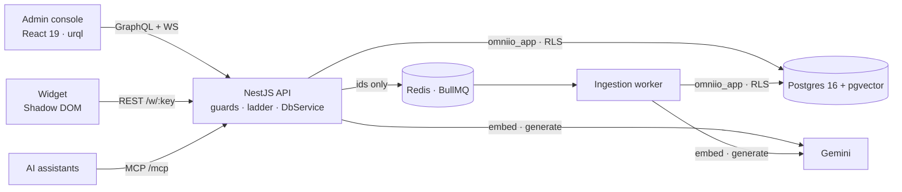

# Architecture

The full document, with 14 diagrams, is **[System Architecture](https://github.com/JawadulHadi/omni-io/blob/main/docs/gist/omni-io-architecture.md)**. It covers system context, runtime containers, the module map, the request pipeline, the ladder, sequence diagrams, the data model, isolation layers and deployment.

## Key decisions

- **Answering is synchronous; ingestion is queued.** A customer is waiting for an answer, so it runs inline under a time budget. Ingestion is long and retryable, so it runs through BullMQ in a separate process.
- **Isolation lives in Postgres.** The app connects as a `NOBYPASSRLS` role, and every unit of work is one short transaction that sets the workspace locally.
- **Model output is untrusted.** It must be schema-valid JSON, may cite only passages it was sent, and must be grounded in them.
- **Plain SQL migrations.** RLS policies, `SECURITY DEFINER` functions and pgvector settings are first-class SQL.

Each decision has an ADR in [`docs/adr/`](https://github.com/JawadulHadi/omni-io/tree/main/docs/adr). The longer write-up is [`docs/ARCHITECTURE.md`](https://github.com/JawadulHadi/omni-io/blob/main/docs/ARCHITECTURE.md).
